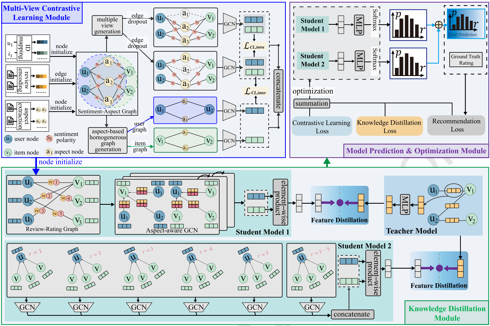

# Denoising Precedes Enrichment: Aspect-Sentiment-aware Graph Contrastive Distillation Network for Review-based Recommendation

Paper link: (https://www.sciencedirect.com/science/article/pii/S0020025525008928)

Recent research progress shows that reviews help improve the performance of recommendations. Most review-based recommendation methods model user preferences for items by directly converting reviews into embeddings. However, reviews often contain substantial irrelevant noise, which might be magnified in the message propagation of the frequent graph learning process. Some studies have attempted to extract fine-grained aspects from reviews to mitigate the noise pollution problem. Nevertheless, the upstream pre-trained models they adopted have problems of mis-detection and under-detection in aspect extraction, resulting in the recontamination of new noise and the loss of crucial information, respectively. 

In response to these challenges, this paper presents a novel aspect-sentiment-aware Graph Contrastive Distillation Network, shortened to GCDNet, which is essentially a framework that first reduces noise and then enhances features. Specifically, GCDNet first constructs both aspect-sentiment-aware graphs and homogeneous aspect-aware graphs, and performs contrastive learning among them to mitigate the negative impacts of mis-detection. Next, knowledge distillation is employed to transfer knowledge from modules with complete review information to aspect-based modules. This process mitigates the insufficient utilization of information due to aspect under-detection. Extensive experiments conducted on five public datasets demonstrate the state-of-the-art performance of the proposed GCDNet, achieving up to 11.11% and an average of 7.92% improvement over previous best models. 

We provide pytorch implementation for GCDNet. 

## prerequisites
torch=2.3.1+cu118

dgl=1.1.2+cu118

## Citation :satisfied:
If our paper and codes are useful to you, please cite:

@article{gcdnet,
title = {Denoising precedes enrichment: aspect-sentiment-aware graph contrastive distillation network for review-basedrecommendation},
author = {Tongtong Yu and Sheng Sang and Kang Liu},
journal = {Information Sciences},
volume = {726},
pages = {122756},
year = {2026},
doi = {https://doi.org/10.1016/j.ins.2025.122756}
}
